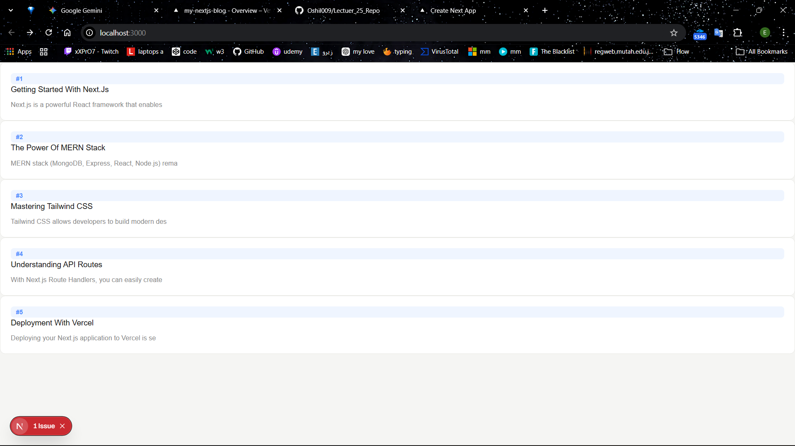
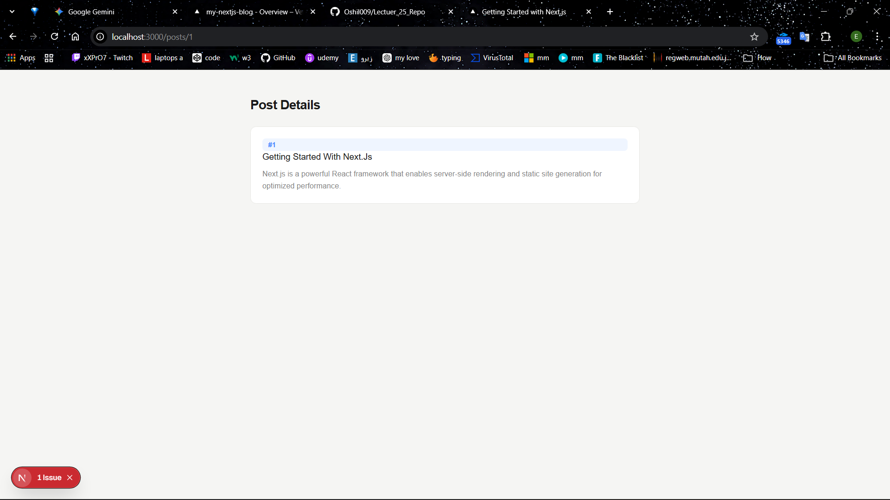
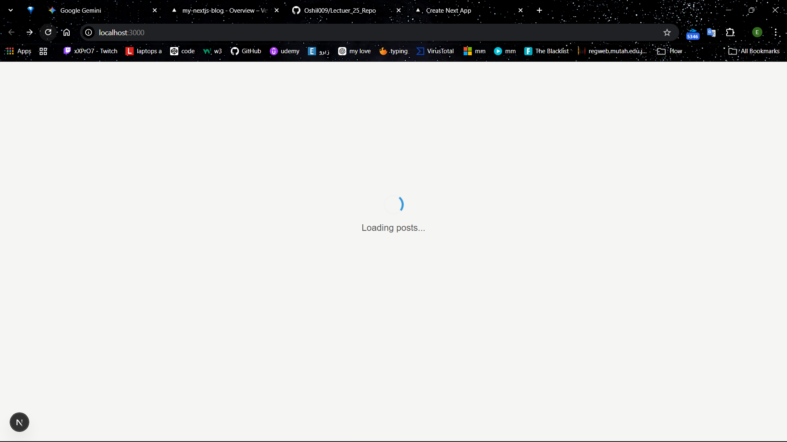

Next.js Dynamic Blog Project
I built this project to practice handling dynamic data and routing in Next.js. It’s a simple blog application that fetches data from an internal API and displays it using dynamic routes.

What is this project?
The main goal was to understand how to manage server-side data fetching and dynamic SEO. I created a mock backend using Next.js Route Handlers to serve blog posts, and then used Server Components to fetch and display that data.

Features I implemented
Internal API: I built a custom API route (/api/posts) using NextResponse to manage the blog data.

Dynamic Routing: Each post has its own page generated dynamically based on its ID using the [id] folder structure.

Dynamic Metadata: I used the generateMetadata function so that each post page shows its own title in the browser tab—great for SEO.

Loading States: Added a loading.js file with a spinner to make the transitions feel smoother while the server is fetching data.

Server-Side Fetching: Used fetch with { cache: "no-store" } to make sure the content is always up to date.

How it works
Home Page: Fetches all posts from my API and lists them as clickable cards.

Post Page: Grabs the id from the URL, finds the matching post, and displays the full content.

API: A simple GET request to /api/posts returns the hardcoded array of post objects.

Live Demo
You can check out the deployed version here:
[https://my-nextjs-blog-ivory-omega.vercel.app/]

